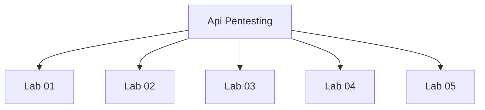

# Api Pentesting - Walkthroughs

## Lab 01

# Lab 1: Exploiting an API endpoint using documentation

## Vulnerability
Exposed API documentation.

## Goal
Find the exposed API documentation and delete the Carlos user.

## Credentials
`wiener:peter`

## Analysis

---

## Lab 02

# Lab 2: Finding and exploiting an unused API endpoint

## Vulnerability
Unused API endpoint.

## Goal
Exploit the hidden API endpoint and buy a Lightweight l33t Leather Jacket.

## Credentials
`wiener:peter.`

## Analysis

---

## Lab 03

# Lab 3: Exploiting server-side parameter pollution in a query string

## Vulnerability
Query string.

## Goal
Exploit parameter pollution to log in as administrator and delete Carlos.

## Credentials
`N/A.`

## Analysis

---

## Lab 04

# Lab 4:  Exploiting a mass assignment vulnerability

## Vulnerability
Unknown parameter.

## Goal
Exploit a mass assignment vulnerability to buy a Lightweight l33t Leather Jacket.

## Credentials
`wiener:peter.`

## Analysis

---

## Lab 05

# Lab 5:  Exploiting server-side parameter pollution in a REST URL

## Vulnerability
Unknown URL.

## Goal
Exploit a parameter pollution to login as the administrator user and delete Carlos. 

## Credentials
`N/A.`

## Analysis

https://internal-api.com/users/administrator#/username

https://internal-api.com/api/internal/v1/users/administrator/field/name

---

