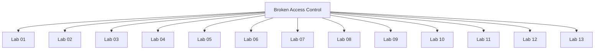

# Broken Access Control - Walkthroughs

## Lab 01: Unprotected admin function

Target Goal - Find the admin panel and delete the user carlos

## Analysis

---

## Lab 02: Unprotected admin functionality with unpredictable URL

Target Goal - Find the admin panel and delete the user carlos.

## Analysis

---

## Lab 03: User role controlled by request parameter

Target Goal - Access admin panel and use it to delete the user carlos.

creds: wiener:peter

## Analysis

---

## Lab 04: User role can be modified in user profile

Target Goal - Access admin panel and use it to delete the user carlos.

creds: wiener:peter

Steps to script:
1. Login as the wiener user
2. Change the role id of the user to 2
3. Access the admin panel and delete the user

---

## Lab 05: URL-based access control can be circumvented

Target Goal - Access the admin panel and delete the Carlos user

---

## Lab 06: Method-based access control can be circumvented

Target Goal - Promote user to become administrator

creds: administrator:admin, wiener:peter

Steps to exploit:

---

## Lab 07: User ID controlled by request parameter

Target Goal - Obtain API key for the user carlos and submit it as a olution

creds: wiener:peter

Steps to exploit:

---

## Lab 08: User ID controlled by request parameter, with unpredictable user IDs

Target Goal - Find the GUID for carlos and compromise his account

creds: wiener:peter

Steps to exploit:

1. Log into the wiener account
2. Loop through all the posts and identify which one is written by the carlos user
3. Extract the GUID
4. Access the Carlos user account
5. Extract the API key of Carlos.

---

## Lab 09: User ID controlled by request parameter with data leakage in redirect

Target Goal - Obtain the API key for the carlos user.

creds: wiener:peter

Steps to exploit:

---

## Lab 10: User ID controlled by request parameter with password disclosure

Target Goal - Retrieve the administrator's password and delete the user carlos.

creds: wiener:peter

Steps to exploit:

1. Log into the wiener account
2. Exploit access control vulnerability to obtain the administrator's password
3. Login as the administrator user
4. Delete the carlos user

---

## Lab 11: Insecure direct object references

Target Goal - Find the Carlos user password and log into his account.

Steps to exploit:

---

## Lab 12: Multi-step process with no access control on one step

Target Goal - Exploit the access control flaw to promote the wiener user to administrator

creds: administrator:admin, wiener:peter

Steps to exploit:

---

## Lab 13: Referer-based access control

Target Goal - Promote the wiener user to administrator

creds: adminstrator:admin, wiener:peter

Steps to exploit:

---

