# Broken Authentication - Walkthroughs

```mermaid
graph TD
    Root["Broken Authentication"]
    Root --> L0["Lab 01"]
    click L0 href "#lab-01"
    Root --> L1["Lab 02"]
    click L1 href "#lab-02"
    Root --> L2["Lab 03"]
    click L2 href "#lab-03"
    Root --> L3["Lab 04"]
    click L3 href "#lab-04"
    Root --> L4["Lab 05"]
    click L4 href "#lab-05"
    Root --> L5["Lab 06"]
    click L5 href "#lab-06"
    Root --> L6["Lab 07"]
    click L6 href "#lab-07"
    Root --> L7["Lab 08"]
    click L7 href "#lab-08"
    Root --> L8["Lab 09"]
    click L8 href "#lab-09"
    Root --> L9["Lab 10"]
    click L9 href "#lab-10"
    Root --> L10["Lab 11"]
    click L10 href "#lab-11"
    Root --> L11["Lab 12"]
    click L11 href "#lab-12"
    Root --> L12["Lab 13"]
    click L12 href "#lab-13"
    Root --> L13["Lab 14"]
    click L13 href "#lab-14"
```

## Lab 01: Username enumeration via different responses

Target goal: Enumerate a valid username and password to access the application.

username: arkansas

---

## Lab 02: 2FA simple bypass

Target Goal - Bypass THE 2FA verification and access Carlos's account.

Your credentials: wiener:peter
Victim's credentials carlos:montoya

---

## Lab 03: Password reset broken logic

Target Goal - Exploit password reset functionality to reset Carlos's password and access his account.

Your credentials: wiener:peter
Victim's username: carlos

---

## Lab 04: Username enumeration via subtly different responses

Target Goal - Enumerate a valid username and then brute-force the user's password.

## Analysis

username -> autodiscover
password -> football

---

## Lab 05: Username enumeration via response timing

Target Goal - Enumerate a valid username and then brute-force the user's password.

Your credentials: wiener:peter

## Analysis

---

## Lab 06: Broken brute-force protection, IP block

Target Goal - Brute force the victim's password

Your credentials: wiener:peter
Victim's username: carlos

carlos
carlos
wiener
carlos
carlos

123456
password
peter
12345678
qwerty

---

## Lab 07: Username enumeration via account lock

Target Goal - Exploit logic flaw to enumerate valid username and then brute-force user's password.

---

## Lab 08: 2FA broken logic

Target Goal - Exploit 2FA logic flaw to access Carlos's account.

Your credentials: wiener:peter
Victim's username: carlos

## Analysis

---

## Lab 09: Brute-forcing a stay-logged-in cookie

Target Goal - Obtain and brute force Carlos's cookie to gain access to his account.

Your credentials: wiener:peter
Victim's username: carlos

base64(username:md5(password))

base64(carlos:md5(x))

---

## Lab 10: Offline password cracking

Target Goal - Exploit XSS vulnerability to obtain Carlos's hashed password, crack it and delete his account.

Your credentials: wiener:peter
Victim's username: carlos

---

## Lab 11: Password reset poisoning via middleware

Target Goal - Exploit the vulnerability in the password reset functionality and access Carlos's account.

Creds - wiener:peter

---

## Lab 12: Password brute-force via password change

Target Goal - Brute-force Carlos's password in the password change functionality.

Your credentials: wiener:peter
Victim's username: carlos

new passwords don't match && current password is incorrect -> Current password is incorrect
new passwords don't match && current password is correct -> New passwords do not match

---

## Lab 13: Broken brute-force protection, multiple credentials per request

Target Goal  - Exploit logic flaw in the brute force protection mechanism and access Carlos's account.

Victim's username: carlos

## Analysis

---

## Lab 14: 2FA bypass using a brute-force attack

Target Goal - Brute-force the 2FA code and access Carlos's account page.

Victim's credentials: carlos:montoya

---

