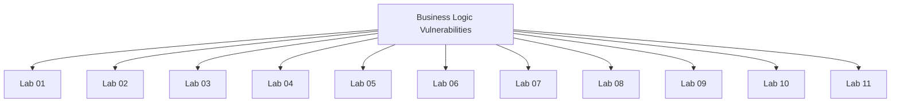

# Business Logic Vulnerabilities - Walkthroughs

## Lab 01: Excessive trust in client-side controls

Target Goal - Exploit logic flaw to buy the Lightweight l33t leather jacket.

Creds - wiener:peter

## Analysis
1. Login as the user*
2. Add an item to the cart*
3. Purchase the item*
4. Confirm that we solved the lab

---

## Lab 02: High-level logic vulnerability

Target Goal - Exploit logic flaw to buy the Lightweight l33t leather jacket.

Creds - wiener:peter

## Analysis

1. Login as the regular user*
2. Buying negative 14 items of the item that costed $95*
3. Buy the jacket*
4. Submit the request and confirm that we solved the lab

---

## Lab 03: Inconsistent security controls

Target Goal - Exploit logic flaw to access the admin panel and delete Carlos

## Analysis

---

## Lab 04: Flawed enforcement of business rules

Target Goal - Exploit logic flaw to buy the Lightweight l33t leather jacket.

Creds - wiener:peter

## Analysis

---

## Lab 05: Low-level logic flaw

Target Goal - Exploit logic flaw to buy the Lightweight l33t leather jacket.

Creds - wiener:peter

## Analysis

---

## Lab 06: Inconsistent handling of exceptional input

Target Goal - Exploit logic flaw in the account registration process to gain access to the admin panel and delete Carlos.

## Analysis

AAAAAAAAAAAAAAAAAAAAAAAAAAAAAAAAAAAAAAAAAAAAAAAAAAAAAAAAAAAAAAAAAAAAAAAAAAAAAAAAAAAAAAAAAAAAAAAAAAAAAAAAAAAAAAAAAAAAAAAAAAAAAAAAAAAAAAAAAAAAAAAAAAAAAAAAAAAAAAAAAAAAAAAAAAAAAAAAAAAAAAAAAAAAAAAAAAAAAAAAAAAAAAAAAAAAAAAAAAAAAAAAAAAAAAAAAAAAAAAAAAAAAAAAAAAAAAA

AAAAAAAAAAAAAAAAAAAAAAAAAAAAAAAAAAAAAAAAAAAAAAAAAAAAAAAAAAAAAAAAAAAAAAAAAAAAAAAAAAAAAAAAAAAAAAAAAAAAAAAAAAAAAAAAAAAAAAAAAAAAAAAAAAAAAAAAAAAAAAAAAAAAAAAAAAAAAAAAAAAAAAAAAAAAAAAAAAAAAAAAAAAAAAAAAAAAAAAAAAAAAAAAAAAAAAAAAAAAAAAAAAAAAAAAAAAAAA@dontwannacry.com.exploit-0ab8003b04410bd6c1f7d9ed01a700ca.exploit-server.net

255 -17 = 238

---

## Lab 07: Weak isolation on dual-use endpoint

Target Goal - Exploit logic flaw to gain access to the administrator account and delete carlos.

Creds - wiener:peter

## Analysis

---

## Lab 08: Insufficient workflow validation

Target Goal - Exploit logic flaw to purchase the "Lightweight l33t leather jacket".

Creds - wiener:peter

## Analysis

---

## Lab 09: Authentication bypass via flawed state machine

Target Goal - Exploit logic flaw to access admin functionality and delete Carlos user.

Creds: wiener:peter

## Analysis

---

## Lab 10: Infinite money logic flaw

Target Goal - Exploit the logic flaw and purchase the Lightweight l33t leather jacket.

Creds - wiener:peter

## Analysis

1337 = 100 + 3x
1227 = 3x
x = 413

---

## Lab 11: Authentication bypass via encryption oracle

Target Goal - Exploit logic flaw to access the admin panel and delete Carlos.

Creds - wiener:peter

## Analysis

---

