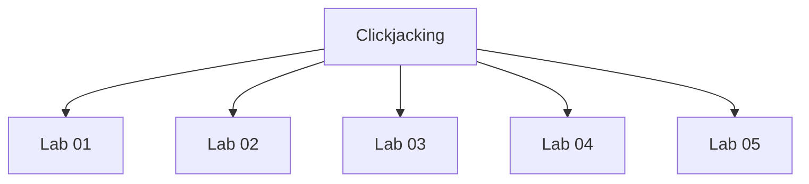

# Clickjacking - Walkthroughs

## Lab 01: Basic clickjacking with CSRF token protection

Target Goal - Perform a clickjacking attack that frames the account page and fools the user into deleting their account.

Creds - wiener:peter

## Analysis

---

## Lab 02: Clickjacking with form input data prefilled from a URL parameter

Target Goal - Perform a clickjacking attack that frames the account page and fools the user into changing their email address.

Creds - wiener:peter

## Analysis

---

## Lab 03: Clickjacking with a frame buster script

Target Goal - Perform a clickjacking attack that frames the account page and fools the user into changing their email address.

Creds - wiener:peter

## Analysis

---

## Lab 04: Exploiting clickjacking vulnerability to trigger DOM-based XSS

Target Goal - Perform a clickjacking attack that exploits an XSS vulnerability to call the print() function.

Creds - wiener:peter

## Analysis

---

## Lab 05: Multistep clickjacking

Target Goal - Perform a multistep clickjacking attack to get the user to delete their account.

Creds - wiener:peter

## Analysis

---

