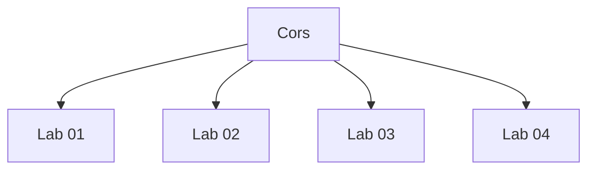

# Cors - Walkthroughs

## Lab 01: CORS vulnerability with basic origin reflection

Target Goal - exploit the CORS misconfiguration to retrieve the administrator's API key

Creds - wiener:peter

## Analysis

Testing for CORS misconfigurations:
1. change the origin to an arbitrary value / True
2.

---

## Lab 02: CORS vulnerability with trusted null origin

Target Goal - exploit the CORS misconfiguration to retrieve the administrator's API key

Creds - wiener:peter

## Analysis

Testing for CORS misconfigurations:
1. Change the origin header to an arbitrary value
2. Change the origin header to the null value
3. 

---

## Lab 03: CORS vulnerability with trusted insecure protocols

Target Goal - exploit the CORS misconfiguration to retrieve the administrator's API key

Creds - wiener:peter

## Analysis

Testing for CORS misconfigurations:
1. Change the origin header to an arbitrary value
2. Change the origin header to the null value
3. Change the origin header to one that begins with the origin of the site.
4. Change the origin header to one that ends with the origin of the site.

---

## Lab 04: CORS vulnerability with internal network pivot attack

Target Goals:
1. Use JS to locate an endpoint on the local network (192.168.0.0/24 port 8080)
2. Exploit CORS misconfiguration to delete user Carlos.

## Analysis

Steps to complete the exercise:
1. Scan the local network (192.168.0.0/24) for endpoints that have port 8080 open.
Completed - http://192.168.0.181:8080

2. Try to find an XSS vulnerability in the login page
Completed - username field vulnerable to XSS.

3. Use the XSS vulnerability in order to access an authenticated page.
Completed - accessed the admin page.

4. Use XSS vulnerability to delete the Carlos user. 

---

