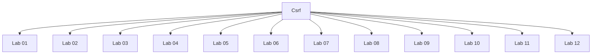

# Csrf - Walkthroughs

## Lab 01: CSRF vulnerability with no defenses

## Vulnerability
email change functionality

## Goal
exploit the CSRF vulnerability and change the email address

## Credentials
`wiener:peter`

## Analysis

In order for a CSRF attack to be possible:
- A relevant action - email change functionality
- Cookie based session handling - session cookie
- No unpredictable request parameters - satisfied

---

## Lab 02: CSRF where token validation depends on request method

## Vulnerability
email change functionality

## Goal
exploit CSRF to change email address

Creds - wiener:peter

## Analysis

In order for a CSRF attack to be possible:
- A relevant action: change a users email
- Cookie-based session handling: session cookie
- No unpredictable request parameters: Request method can be changed to GET which does not require CSRF token

Testing CSRF Tokens:
1. Change the request method from POST to GET

---

## Lab 03: CSRF where token validation depends on token being present

## Vulnerability
email change functionality

## Goal
exploit CSRF to change email address

Creds - wiener:peter

## Analysis

In order for a CSRF attack to be possible:
- A relevant action: change a users email
- Cookie-based session handling: session cookie
- No unpredictable request parameters: csrf token is not mandatory

Testing CSRF Tokens:
1. Remove the CSRF token and see if application accepts request
2. Change the request method from POST to GET

---

## Lab 04: CSRF where token is not tied to user session

## Vulnerability
email change functionality

## Goal
exploit CSRF to change email address

Credentials - wiener:peter, carlos:montoya

## Analysis

In order for a CSRF attack to be possible:
- A relevant action: change a users email
- Cookie-based session handling: session cookie
- No unpredictable request parameters: csrf token is not tied to user session

Testing CSRF Tokens:
1. Remove the CSRF token and see if application accepts request
2. Change the request method from POST to GET
3. See if csrf token is tied to user session

---

## Lab 05: CSRF where token is tied to non-session cookie

## Vulnerability
email change functionality

## Goal
exploit CSRF to change email address

Creds - wiener:peter, carlos:montoya

## Analysis

In order for a CSRF attack to be possible:
- A relevant action: change a users email
- Cookie-based session handling: session cookie
- No unpredictable request parameters 

Testing CSRF Tokens:
1. Remove the CSRF token and see if application accepts request
2. Change the request method from POST to GET
3. See if csrf token is tied to user session

Testing CSRF Tokens and CSRF cookies:
1. Check if the CSRF token is tied to the CSRF cookie
   - Submit an invalid CSRF token
   - Submit a valid CSRF token from another user
2. Submit valid CSRF token and cookie from another user

csrf token: SXsROOTp3jzq6M5UzIL2KkJIqGpffIQb
csrfKey cookie: ho7GGxMe4EZSrQ8xZ0sBDq2yW0ey9bKH

In order to exploit this vulnerability, we need to perform 2 things:
1. Inject a csrfKey cookie in the user's session (HTTP Header injection) - satisfied
2. Send a CSRF attack to the victim with a known csrf token

---

## Lab 06: CSRF where token is duplicated in cookie

## Vulnerability
email change functionality

## Goal
exploit CSRF to change email address

Creds - wiener:peter

## Analysis

In order for a CSRF attack to be possible:
- A relevant action: change a users email
- Cookie-based session handling: session cookie
- No unpredictable request parameters 

Testing CSRF Tokens:
1. Remove the CSRF token and see if application accepts request
2. Change the request method from POST to GET
3. See if csrf token is tied to user session

Testing CSRF Tokens and CSRF cookies:
1. Check if the CSRF token is tied to the CSRF cookie
   - Submit an invalid CSRF token
   - Submit a valid CSRF token from another user
2. Submit valid CSRF token and cookie from another user

In order to exploit this vulnerability, we need to perform 2 things:
1. Inject a csrf cookie in the user's session (HTTP Header injection) - satisfied
2. Send a CSRF attack to the victim with a known csrf token

---

## Lab 07: CSRF where Referer validation depends on header being present

## Vulnerability
email change functionality

## Goal
exploit CSRF to change email address

Creds - wiener:peter

## Analysis

In order for a CSRF attack to be possible:
- A relevant action: change a users email
- Cookie-based session handling: session cookie
- No unpredictable request parameters: no csrf token

Testing Referer header for CSRF attacks:
1. Remove the Referer header

---

## Lab 08: CSRF where token is duplicated in cookie

## Vulnerability
email change functionality

## Goal
exploit CSRF to change email address

Creds - wiener:peter

## Analysis

In order for a CSRF attack to be possible:
- A relevant action: change a users email
- Cookie-based session handling: session cookie
- No unpredictable request parameters (satisfied b/c no csrf token)

Testing Referer header for CSRF attacks:
1. Remove the Referer header
2. Check which portion of the referrer header is the application validating

---

## Lab 09: SameSite Lax bypass via method override

## Goal
Exploit CSRF to change the victim's email address.

Creds - wiener:peter

## Analysis

---

## Lab 10: SameSite Strict bypass via client-side redirect

## Goal
Exploit CSRF to change the victim's email address.

Creds - wiener:peter

## Analysis

---

## Lab 11: SameSite Strict bypass via sibling domain

## Goal
Perform a cross-site websocket hijacking attack to exfiltrate the victim's chat history and compromise the victim's account.

## Analysis

Cross-Site Websocket Hijacking Attack:
--------------------------------------

Cross-Site Websocket Hijacking Attack + XSS:
--------------------------------------------

---

## Lab 12: SameSite Lax bypass via cookie refresh

## Goal
Exploit CSRF to change the victim's email address

Creds - wiener:peter

## Analysis

<form action="https://0a92009603dec172800c172d00cb00ee.web-security-academy.net/my-account/change-email" method="POST">
    <input type="hidden" name="email" value="test4@test.ca"/>
</form>

Click anywhere on the page

---

