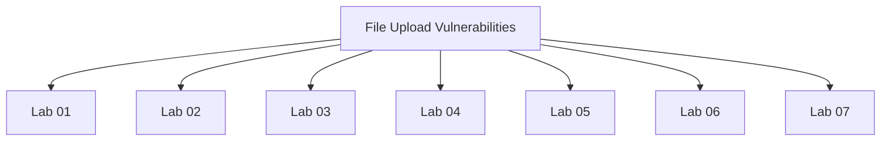

# File Upload Vulnerabilities - Walkthroughs

## Lab 01: Remote code execution via web shell upload

Target Goal - Exploit the file upload vulnerability to exfiltrate the contents of the file /home/carlos/secret

Creds - wiener:peter

## Analysis

---

## Lab 02: Web shell upload via Content-Type restriction bypass

Target Goal - Exploit the file upload vulnerability to exfiltrate the contents of the file /home/carlos/secret

Creds - wiener:peter

## Analysis

---

## Lab 03: Web shell upload via path traversal

Target Goal - Exploit file upload vulnerability to upload a PHP web shell and exfiltrate the contents of the /home/carlos/secret

Creds - wiener:peter

## Analysis

---

## Lab 04: Web shell upload via extension blacklist bypass

Target Goal - Bypass blacklist defense and upload a PHP web shell to exfitrate the contents of the file /home/carlos/secret

Creds - wiener:peter

## Analysis

---

## Lab 05: Web shell upload via obfuscated file extension

Target Goal - Exploit a file upload vulnerability to upload a web shell and exfiltrate the contents of the file /home/carlos/secret

Creds - wiener:peter

## Analysis

---

## Lab 06: Remote code execution via polyglot web shell upload

Target Goal - Exploit file upload vulnerability to exfiltrate the contents of the /home/carlos/secret

Creds - wiener:peter

## Analysis

---

## Lab 07: Web shell upload via race condition

Target Goal - Exploit file upload vulnerability to exfiltrate the contents of the /home/carlos/secret

Creds - wiener:peter

## Analysis

def queueRequests(target, wordlists):
    engine = RequestEngine(endpoint=target.endpoint,
                           concurrentConnections=10,
                           requestsPerConnection=100,
                           pipeline=False
                           )

    request1 = '''
<add post request here>
'''

    
    request2 = '''
<add get request here>
\r\n
'''

    # the 'gate' argument blocks the final byte of each request until openGate is invoked
    engine.queue(request1, gate='race1')
    for i in range(9):
        engine.queue(request2, gate='race1')

    # wait until every 'race1' tagged request is ready
    # then send the final byte of each request
    # (this method is non-blocking, just like queue)
    engine.openGate('race1')

    engine.complete(timeout=60)

def handleResponse(req, interesting):
    table.add(req)

---

