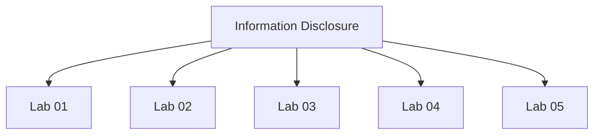

# Information Disclosure - Walkthroughs

## Lab 01: Information disclosure in error messages

Target Goal - Exploit the vulnerability to obtain the version of the third-party framework.

---

## Lab 02: Information disclosure on debug page

Target Goal - Exploit vulnerability to obtain the SECRET_KEY environment variable.

nofquxlwnia40cp4qclf0use8u9vcc47 

---

## Lab 03: Source code disclosure via backup files

Target Goal - Find the hidden back up file and retrieve the database password.

lewpap0k8r0mnqyq6j2jwue9hl9gj90b

---

## Lab 04: Authentication bypass via information disclosure

Creds - wiener:peter

Target Goal - Exploit vulnerability to obtain the SECRET_KEY environment variable.

---

## Lab 05: Information disclosure in version control history

Target Goal - Disclose the administrator's credentials and delete the Carlos user.

---

