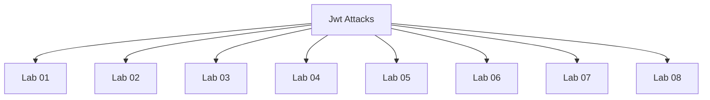

# Jwt Attacks - Walkthroughs

## Lab 01: JWT authentication bypass via unverified signature

## Vulnerability
JWT

## Goal
modify the session token to gain access to the /admin panel and delete the user carlos

## Credentials
`wiener:peter`

## Analysis

Testing for JWT vulnerabilities:
- Check if the JWT signature is verified

---

## Lab 02: JWT authentication bypass via flawed signature verification

## Vulnerability
JWT

## Goal
modify the session token to gain access to the /admin panel and delete the user carlos

## Credentials
`wiener:peter`

## Analysis

Testing for JWT vulnerabilities:
1) Check if the JWT signature is verified.
2) Check if the application accepts an unsigned JWT / none algorithm

---

## Lab 03: JWT authentication bypass via weak signing key

## Vulnerability
JWT

## Goal
Brute-force the website's secret key, use it to craft an administrator JWT and delete the user carlos.

## Credentials
`wiener:peter`

## Analysis

Testing for JWT vulnerabilities:
1) Check if the JWT signature is verified.
2) Check if the application accepts an unsigned JWT / none algorithm
3) Check for weak signing key / brute forcable secret key (symmetric)

---

## Lab 04: JWT authentication bypass via jwk header injection

## Vulnerability
JWT

## Goal
modify and sign the JWT and delete the user carlos

## Credentials
`wiener:peter`

## Analysis

Testing for JWT vulnerabilities:
1) Check if the JWT signature is verified.
2) Check if the application accepts an unsigned JWT / none algorithm
3) Check for weak signing key / brute-force secret key (symmetric)
4) Check if the application accepts an arbitrary injected jwk header / jwk injection (public-key)

---

## Lab 05: JWT authentication bypass via jku header injection

## Vulnerability
JWT

## Goal
Forge a JWT by adding the jku parameter and delete the user carlos

## Credentials
`wiener:peter`

## Analysis

Testing for JWT vulnerabilities:
1) Check if the JWT signature is verified.
2) Check if the application accepts an unsigned JWT / none algorithm
3) Check for weak signing key / brute-force secret key
4) Check if the application accepts an arbitrary injected jwk parameter
5) Check if the application accepts an arbitrary jku parameter

- Generate our RSA key
- Add the public key in the exploit server
- Modify the JWT to include the jku parameter and the subject administrator
- sign the jwt using the private key 

---

## Lab 06: JWT authentication bypass via kid header path traversal

## Vulnerability
JWT

## Goal
modify and sign the JWT and delete the user carlos

## Credentials
`wiener:peter`

## Analysis

Testing for JWT vulnerabilities:
1) Check if the JWT signature is verified.
2) Check if the application accepts an unsigned JWT / none algorithm
3) Check for weak signing key / brute-force secret key
4) Check if the application accepts an arbitrary injected jwk header
5) Check if the application accepts an arbitrary jku header
6) Check if the kid parameter is vulnerable to path traversal.

/dev/null

---

## Lab 07: JWT authentication bypass via algorithm confusion

## Vulnerability
JWT

## Goal
modify and sign the JWT and delete the user carlos

## Credentials
`wiener:peter`

## Analysis

Testing for JWT vulnerabilities:
1) Check if the JWT signature is verified.
2) Check if the application accepts an unsigned JWT / none algorithm
3) Check for weak signing key / brute-force secret key
4) Check if the application accepts an arbitrary injected jwk header
5) Check if the application accepts an arbitrary jku header
6) Check if the kid parameter is vulnerable to path traversal.
7) Check if the application is vulnerable to algorithm confusion.

1. Symmetric algorithms - one key is used to both sign and verify the signature of the token.

2. Asymmetric algorithms - 2 keys.
  - one is used to sign the token (private key)
  - another key that is used to verify the token (public key)

---

## Lab 08: JWT authentication bypass via algorithm confusion with no exposed key

## Vulnerability
JWT

## Goal
modify and sign the JWT and delete the user carlos

## Credentials
`wiener:peter`

## Analysis

Testing for JWT vulnerabilities:
1) Check if the JWT signature is verified.
2) Check if the application accepts an unsigned JWT / none algorithm
3) Check for weak signing key / brute-force secret key
4) Check if the application accepts an arbitrary injected jwk header
5) Check if the application accepts an arbitrary jku header
6) Check if the kid parameter is vulnerable to path traversal.
7) Check if the application is vulnerable to algorithm confusion.

1 - Symmetric algorithm - one key
2 - Asymmetric algorithms - 2 keys
    - sign token / private key
    - verify token / public key

---

