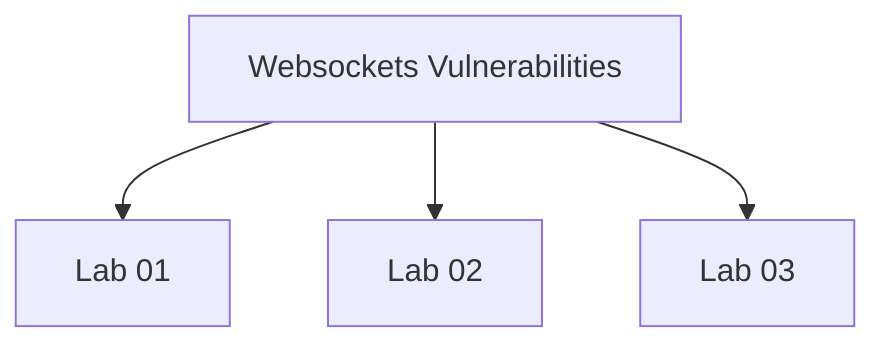

# Websockets Vulnerabilities - Walkthroughs

## Lab 01: Manipulating WebSocket messages to exploit vulnerabilities

Target Goal - Exploit an XSS vulnerability in the WebSocket message and trigger an alert() popup.

## Analysis

---

## Lab 02: Manipulating the WebSocket handshake to exploit vulnerabilities

Target Goal - Bypass the XSS filter and exploit the XSS vulnerability to trigger the alert() popup

## Analysis

X-Forwarded-For: 1.1.1.1

---

## Lab 03: Cross-site WebSocket hijacking

Target Goal - Perform a cross-site WebSocket hijacking attack to exfiltrate the victim's chat history.

## Analysis

Burp Suite Professional:
-------------------------

Burp Suite Community:
---------------------

---

